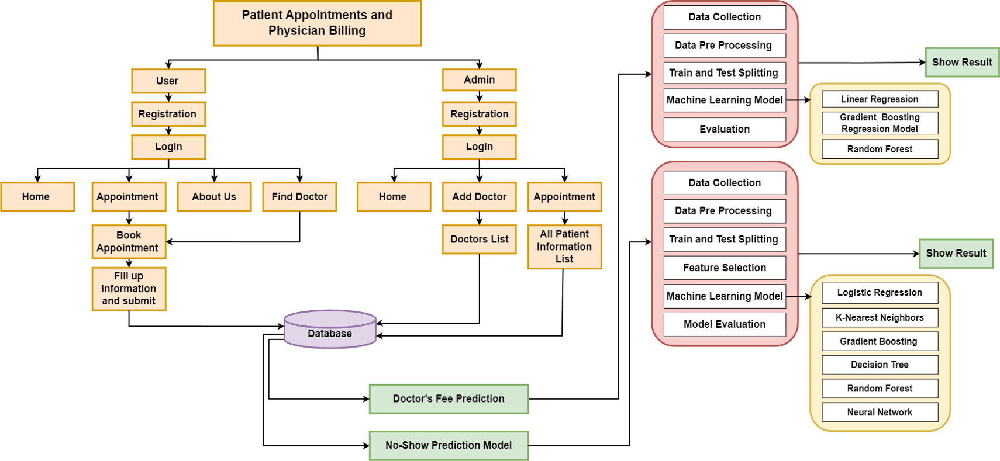

<a href="https://github.com/ParvasHossain/Capston_Machine_Learning_for_Predictive_Analytics_in_Healthcare">
   <span style="display: inline-block; background: #0070f3; color: white; font-family: sans-serif; font-weight: bold; padding: 12px 24px; border-radius: 7px; box-shadow: 0 4px 14px 0 rgba(0, 118, 243, 0.39);">
    🚀Click To View Main Repository →
  </span>
</a>
<br>
<br>
"Please Have A Look To See The Machine Learning Implement On An Exixting System"
<p align="left">
  
</p>

# Doctor's Portal System

A comprehensive, full-stack Doctor's Portal Web Application built with the **MERN** stack (**M**, Express.js, **React**, **Node.js**). This platform connects patients with healthcare providers, allowing patients to easily view available medical services, book appointments, and manage their health schedules online.

---

##  Features

* **Interactive Appointment Booking**: Patients can select specific dates and choose from available time slots for various medical services.
* **User Authentication**: Secure user registration and login functionality utilizing Firebase Authentication.
* **Service Showcase**: Displays detailed medical categories including Dental Care, Oral Surgery, Cavity Inspection, and General Checkups.
* **Patient Dashboard**: Patients can view their upcoming appointments, history, and booking status.
* **Admin Dashboard**: Admin/Doctor interface to manage booked appointments, view patient lists, and handle portal settings.
* **Responsive Design**: Modern, clean, and fully mobile-friendly UI built with Tailwind CSS / DaisyUI.

---

##  Tech Stack

* **Frontend**: React.js, React Router, Tailwind CSS, DaisyUI
* **Backend**: Node.js, Express.js
* **Database**: MongoDB
* **Authentication**: Firebase Auth

---

##  Getting Started

Follow these instructions to get a copy of the project up and running on your local machine.

### Prerequisites

Make sure you have the following installed:
* [Node.js](https://nodejs.org/) (v14 or higher)
* [npm](https://www.npmjs.com/) or [yarn](https://yarnpkg.com/)
* [Git](https://git-scm.com/)

### Installation

1. **Clone the repository:**
   ```bash
   git clone [https://github.com/your-username/doctors_portal_system.git](https://github.com/your-username/doctors_portal_system.git)
   cd doctors_portal_system
